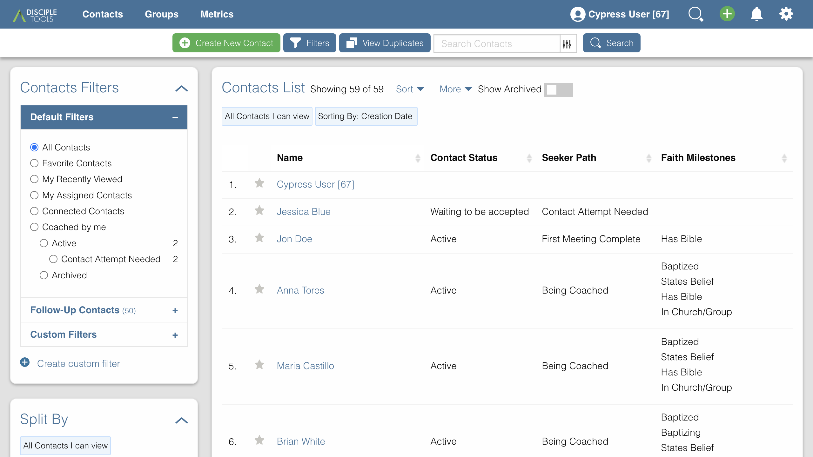
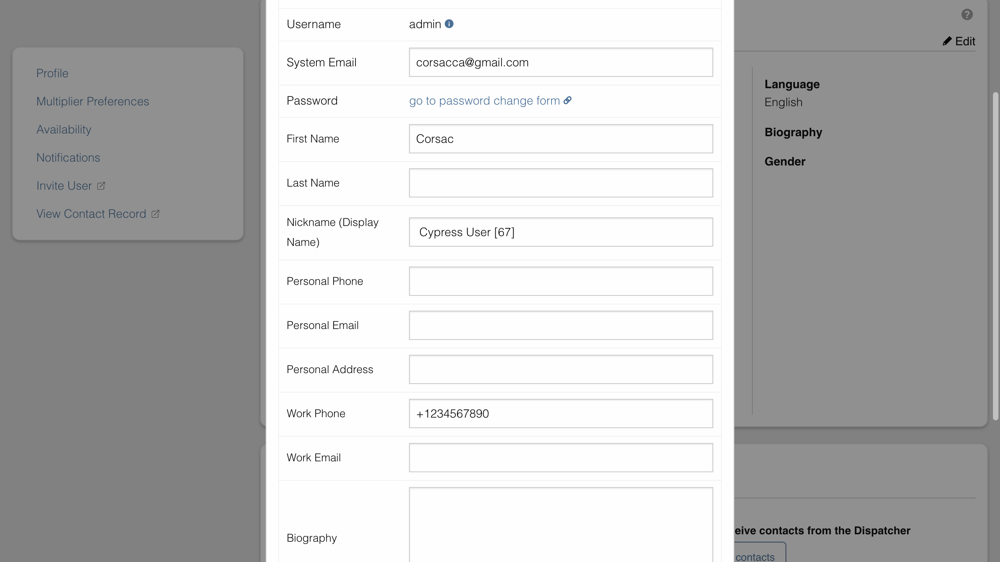
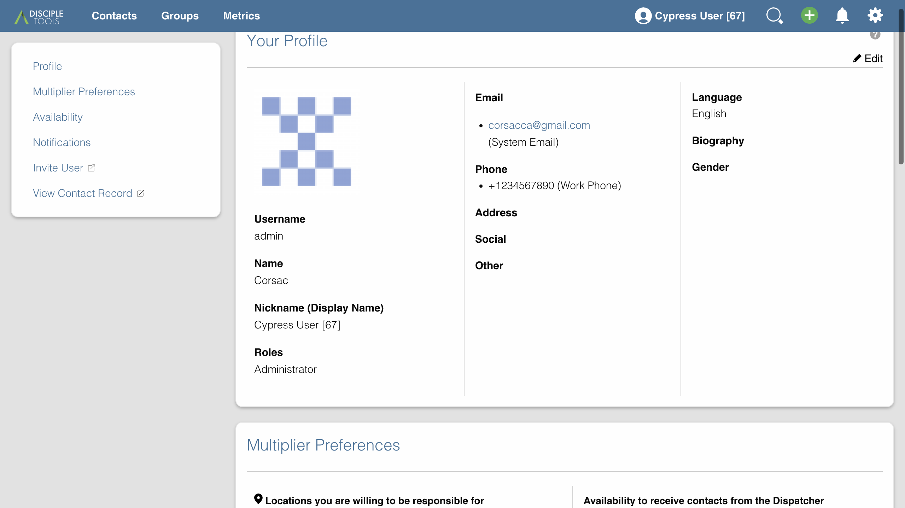

# Changing Your Display Name in Disciple.Tools

Your display name is how other users see you in Disciple.Tools. This guide walks you through the process of changing your display name through the Settings page.

## Table of Contents
- [Introduction](#introduction)
- [Accessing Your Settings](#accessing-your-settings)
- [Changing Your Display Name](#changing-your-display-name)
- [Understanding Display Name vs. Username](#understanding-display-name-vs-username)
- [Why Display Names Matter](#why-display-names-matter)

## Introduction

In Disciple.Tools, your display name (also called a nickname) is shown throughout the platform whenever you're mentioned, assigned to records, or shown in activity logs. Customizing your display name helps team members easily identify you.

## Accessing Your Settings

To access your personal settings:

1. Log in to your Disciple.Tools instance
2. Click on the **Settings** link in the top navigation bar or visit `/settings` directly

## Changing Your Display Name

To change your display name:

1. On the Settings page, locate the **Profile** tab (this should be open by default)
2. Scroll down to the **Update Your Contact Information** section
3. Find the **Nickname (Display Name)** field
4. Enter your preferred display name
5. Click the **Update** button at the bottom of the form

After updating, your new display name will immediately appear throughout the platform.

## Understanding Display Name vs. Username

It's important to understand the difference between your display name and username:

- **Username**: Used for logging in and cannot be changed easily
- **Display Name**: How you appear to others in the system and can be updated at any time

## Why Display Names Matter

A clear, recognizable display name helps:

1. Team collaboration - colleagues can easily identify you
2. Contact management - contacts can see who they're assigned to
3. Activity tracking - your activities are properly attributed

Choose a display name that reflects how you want to be known within your Disciple.Tools community. 