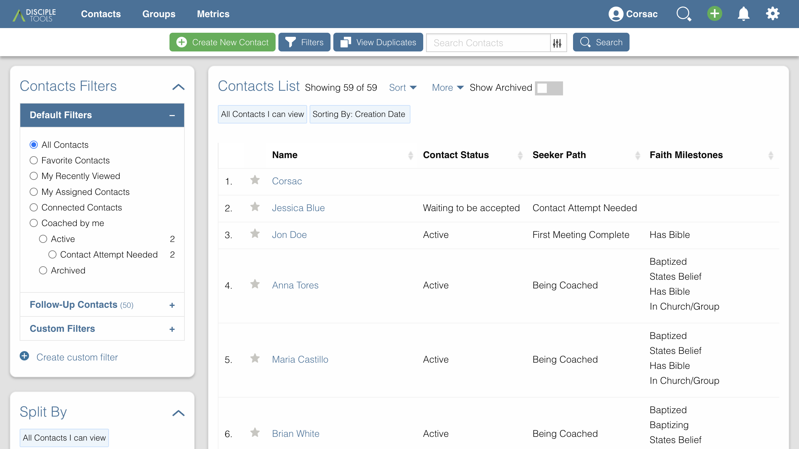
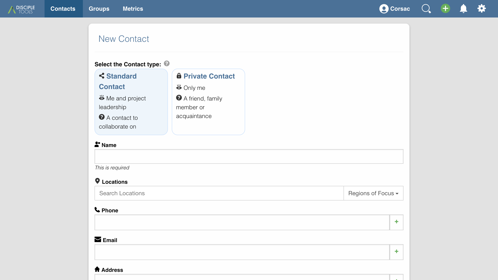
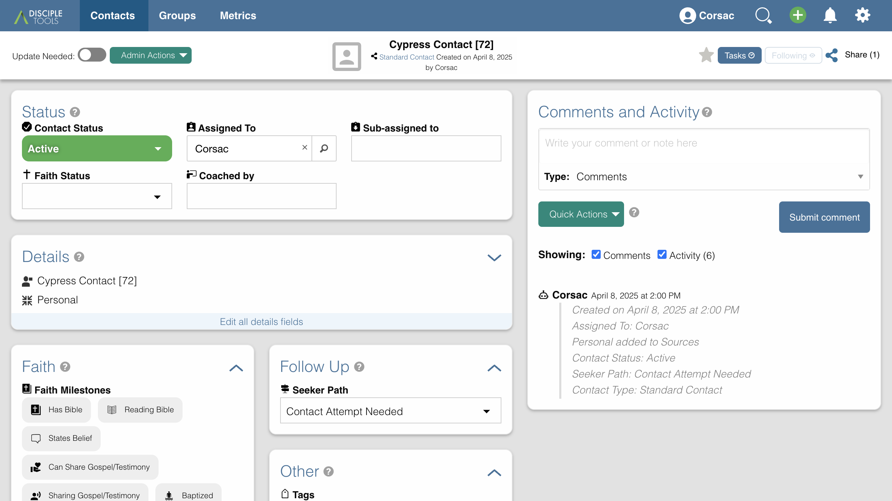
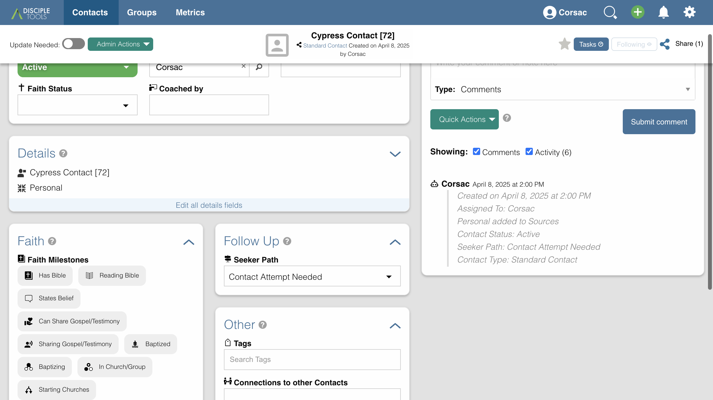

# Creating and Managing Contacts

Contacts are the heart of Disciple.Tools, representing individuals you're connecting with in your ministry. This guide walks you through creating and managing contacts effectively.

## Table of Contents
- [Introduction](#introduction)
- [Accessing Contacts](#accessing-contacts)
- [Creating a New Contact](#creating-a-new-contact)
  - [Basic Contact Information](#basic-contact-information)
  - [Setting Communication Channels](#setting-communication-channels)
  - [Additional Fields](#additional-fields)
- [Managing Contacts](#managing-contacts)
  - [Viewing Contact Details](#viewing-contact-details)
  - [Updating Contact Information](#updating-contact-information)
  - [Contact Tiles](#contact-tiles)
- [Establishing Connections](#establishing-connections)
  - [Connecting to Groups](#connecting-to-groups)
  - [Connecting to Other Contacts](#connecting-to-other-contacts)
- [Filtering and Searching Contacts](#filtering-and-searching-contacts)
- [Contact Workflows](#contact-workflows)

## Introduction

Contacts in Disciple.Tools represent the individuals with whom you're building relationships in your ministry. Properly documenting contact information and interactions helps your team collaborate effectively and ensures no one falls through the cracks.

## Accessing Contacts

To access your contacts:

1. Log in to your Disciple.Tools instance
2. In the top navbar, click on **Contacts**

## Creating a New Contact

### Basic Contact Information

To create a new contact:

1. From the Contacts list view, click the **Add New** button in the top right
2. Fill in the required information:
   - **Name**: The contact's full name (required)
   - **Phone**: Primary phone number
   - **Email**: Primary email address
   - **Location**: Where the contact is located

3. Click **Save** to create the contact

### Setting Communication Channels

Communication channels allow you to store different ways to reach your contact:

1. In the **Contact Information** tile, locate the **Contact Information** section
2. Add a phone number, email, or other communication method
3. For phones, you can specify the type (mobile, work, etc.)
4. For each channel, you can mark it as "Primary" to indicate the preferred method

### Additional Fields

Depending on your Disciple.Tools configuration, you may see additional fields such as:

- **Gender**
- **Age**
- **Status**: The current relationship status with this contact
- **Assigned To**: Team member responsible for this contact
- **Source**: How you first connected with this contact
- **Tags**: Custom categories to help organize contacts

## Managing Contacts

### Viewing Contact Details

After creating a contact, you'll be taken to their details page, which displays all information organized in tiles.

### Updating Contact Information

To update any contact information:

1. Navigate to the contact's details page
2. Click on the field you want to update
3. Make your changes
4. The system automatically saves your changes

### Contact Tiles

Contact information is organized into tiles, each containing related fields:

- **Contact Details**: Basic information and status
- **Contact Information**: Communication channels and location
- **Faith**: Faith journey information
- **Connections**: Relationships to other records
- **Activity**: Timeline of interactions
- **Notes**: Additional information about the contact

## Establishing Connections

### Connecting to Groups

To connect a contact to a group:

1. On the contact details page, locate the **Connections** tile
2. Under **Groups**, click **Add**
3. Search for and select the group
4. Specify the connection type (member, leader, etc.)
5. Click **Save**

### Connecting to Other Contacts

Similarly, you can connect contacts to other contacts:

1. In the **Connections** tile, under **Contacts**, click **Add**
2. Search for and select the related contact
3. Specify the relationship type (family, friend, etc.)
4. Click **Save**

## Filtering and Searching Contacts

To find specific contacts:

1. From the Contacts list view, use the search bar at the top
2. Alternatively, use the filters panel on the right to narrow down by:
   - Status
   - Assigned to
   - Location
   - Tags
   - And other available fields

## Contact Workflows

Contacts typically follow a progression through different statuses as your relationship develops:

1. **New**: Recently added contacts that need initial follow-up
2. **Active**: Contacts you're actively engaging with
3. **Paused**: Temporarily inactive contacts
4. **Closed**: Contacts you're no longer pursuing
5. **Multiplying**: Contacts who are actively making new disciples

As you interact with a contact, update their status to reflect the current state of your relationship and track their faith journey progress.

You can customize your contact list view to display contacts grouped by their current status, making it easier to prioritize your ministry efforts. 