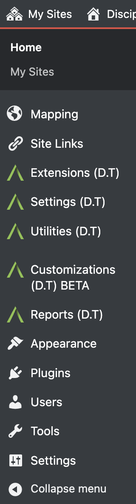
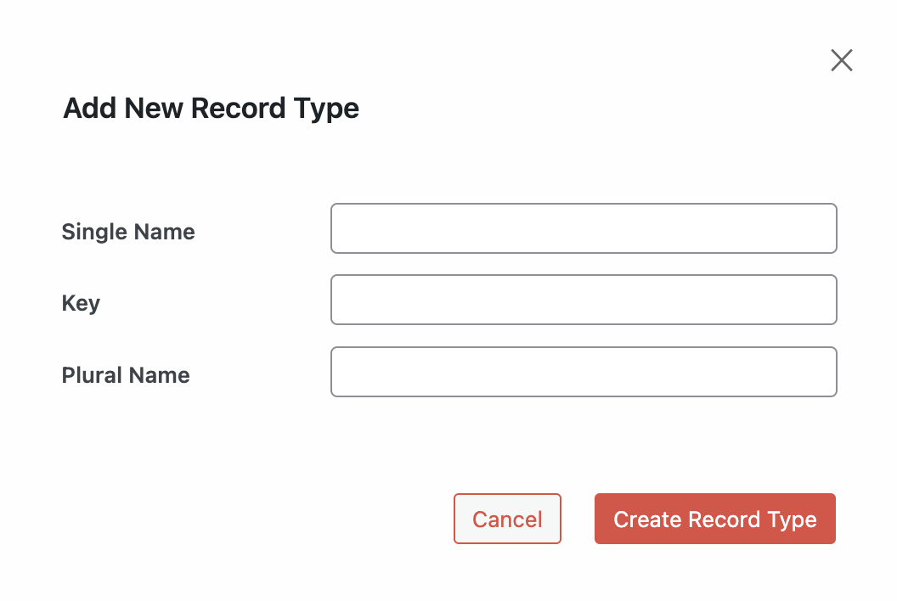
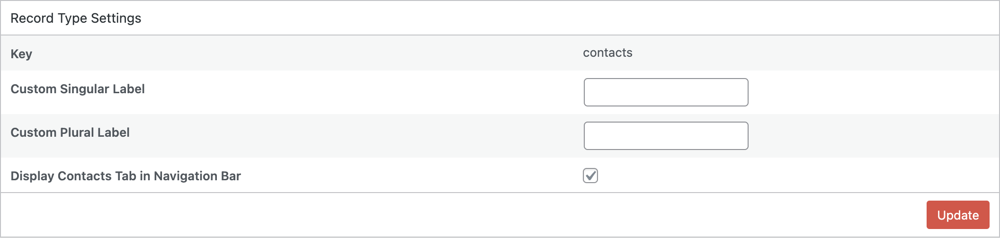
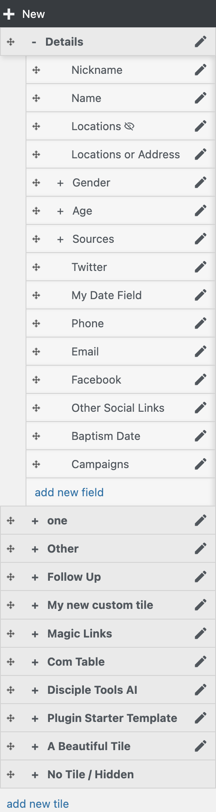
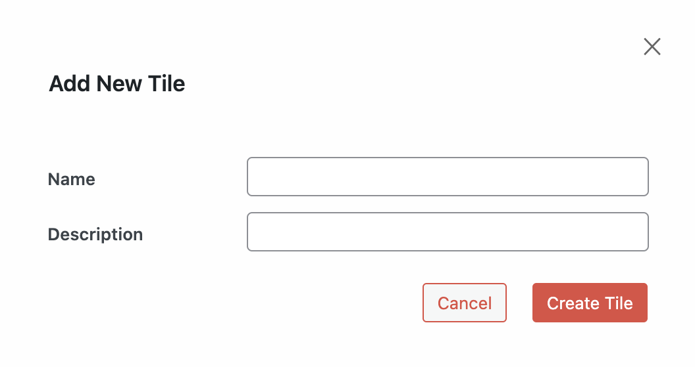
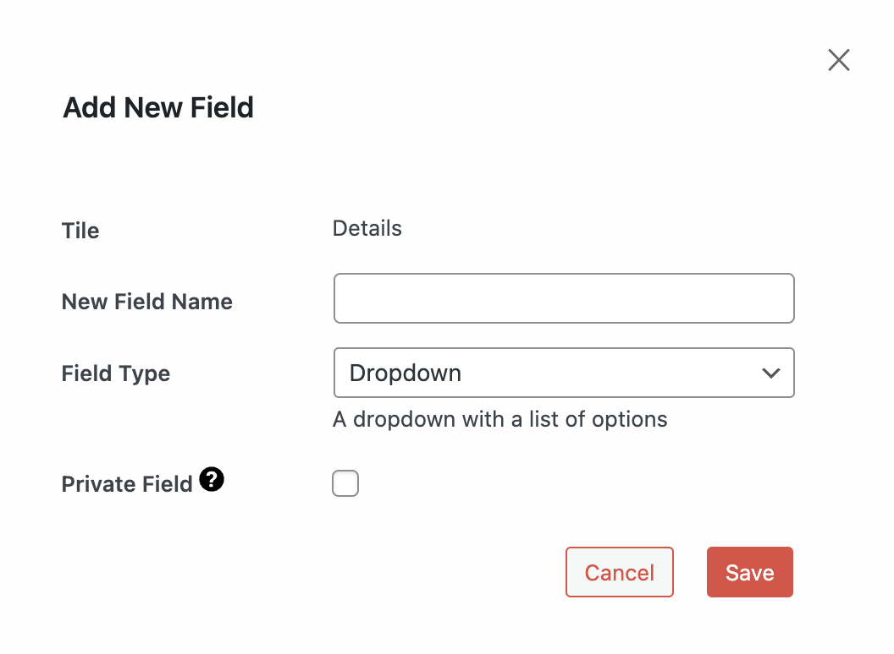
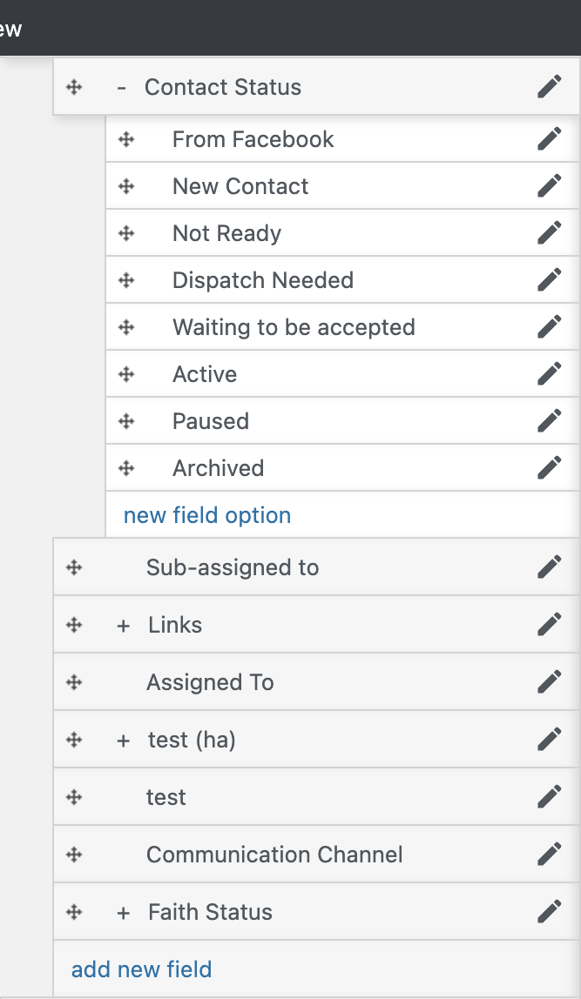
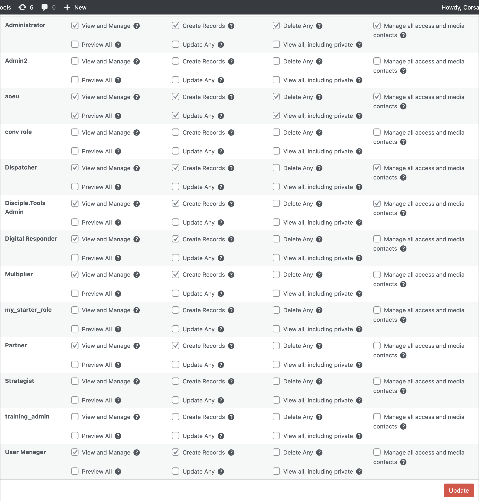

# Customizations (D.T) BETA

The Customizations feature in Disciple.Tools allows administrators to customize the platform to match their unique ministry needs without requiring technical knowledge or coding skills.

## Table of Contents
- [Introduction](#introduction)
- [Accessing the Customizations Menu](#accessing-the-customizations-menu)
- [Working with Record Types](#working-with-record-types)
  - [Creating a New Record Type](#creating-a-new-record-type)
  - [Modifying Record Type Settings](#modifying-record-type-settings)
  - [Deleting a Record Type](#deleting-a-record-type)
- [Working with Tiles](#working-with-tiles)
  - [Understanding Tiles](#understanding-tiles)
  - [Creating a New Tile](#creating-a-new-tile)
  - [Modifying Tiles](#modifying-tiles)
  - [Reordering Tiles](#reordering-tiles)
- [Working with Fields](#working-with-fields)
  - [Understanding Field Types](#understanding-field-types)
  - [Adding a New Field](#adding-a-new-field)
  - [Modifying Existing Fields](#modifying-existing-fields)
  - [Reordering Fields](#reordering-fields)
  - [Field Options](#field-options)
- [Role Permissions](#role-permissions)

## Introduction

Disciple.Tools' Customizations feature empowers you to:

- Create custom record types beyond the default Contacts and Groups
- Add new tiles to organize fields
- Create custom fields with various data types
- Modify existing fields
- Manage user permissions for different record types

## Accessing the Customizations Menu

To access the Customizations menu:

1. Log in to your Disciple.Tools instance as an administrator
2. In the left sidebar, click on **Customizations (D.T)**

## Working with Record Types

Record types are the primary data types in Disciple.Tools, such as Contacts and Groups. The Customizations menu allows you to modify existing record types and create new ones.

### Creating a New Record Type

To create a new record type:

1. From the Customizations menu, click the **New Record Type** button
2. Fill in the required information:
   - **Key**: The internal identifier for the record type (no spaces, lowercase)
   - **Singular Label**: How the record type will be displayed in singular form (e.g., "Project")
   - **Plural Label**: How the record type will be displayed in plural form (e.g., "Projects")
3. Click **Create**

### Modifying Record Type Settings

To modify an existing record type:

1. Click on the record type pill at the top of the Customizations page
2. Click on the **Settings** tab
3. Modify the settings as needed:
   - **Custom Singular Label**: Change how the record type is displayed in singular form
   - **Custom Plural Label**: Change how the record type is displayed in plural form
   - **Display Tab in Navigation Bar**: Toggle whether the record type appears in the main navigation
4. Click **Update** to save your changes

### Deleting a Record Type

> **Warning**: Deleting a record type will permanently delete all records of that type. This action cannot be undone.

To delete a custom record type:

1. Navigate to the record type's Settings tab
2. Click the **Delete** button at the bottom
3. Confirm the deletion

## Working with Tiles

### Understanding Tiles

Tiles are the boxes that organize fields on the record details page. They help categorize information for better usability.

### Creating a New Tile

To create a new tile:

1. Select a record type from the top of the Customizations page
2. At the bottom of the tiles list, click **add new tile**
3. Fill in the tile details:
   - **Tile Key**: Internal identifier for the tile (no spaces, lowercase)
   - **Tile Label**: Display name for the tile
   - **Icon**: Optional icon for the tile
4. Click **Create Tile**

### Modifying Tiles

To edit an existing tile:

1. Click on the edit icon next to the tile name
2. Modify the tile details as needed
3. Click **Update Tile** to save your changes

### Reordering Tiles

You can change the order of tiles by dragging and dropping them into the desired position:

1. Hover over a tile to see the drag handle (four-arrow icon)
2. Click and hold the drag handle
3. Drag the tile to the desired position
4. Release to drop the tile in the new position

## Working with Fields

Fields are individual data elements within tiles that store specific types of information.

### Understanding Field Types

Disciple.Tools offers various field types to capture different kinds of information:

- **Text**: Simple single-line text input
- **Textarea**: Multi-line text for longer content
- **Number**: Numeric values only
- **Date**: Date selector
- **Key Select**: Single selection from predefined options
- **Multi-Select**: Multiple selections from predefined options
- **Tags**: User-creatable tags for flexible categorization
- **Connection**: Relationships to other record types
- **User Select**: Select users from your Disciple.Tools instance
- **Location**: Geographic location selection
- **Communication Channel**: Contact methods like phone, email, etc.
- **Boolean**: True/false toggle
- **Link**: Web links with categories

### Adding a New Field

To add a new field:

1. Expand a tile by clicking the plus sign (+) next to its name
2. Click **add new field** at the bottom of the expanded tile
3. Fill in the field details:
   - **Field Key**: Internal identifier (no spaces, lowercase)
   - **Field Label**: Display name for the field
   - **Field Type**: Type of data the field will store
   - **Description**: Optional help text
   - **Icon**: Optional icon for the field
   - Additional settings specific to the field type
4. Click **Create Field**

### Modifying Existing Fields

To edit an existing field:

1. Expand the tile containing the field
2. Click on the edit icon next to the field name
3. Modify the field details as needed
4. Click **Update Field** to save your changes

You can also hide fields without deleting them by toggling the **Hidden** option.

### Reordering Fields

Like tiles, fields can be reordered using drag and drop:

1. Expand the tile containing the fields
2. Hover over a field to see the drag handle
3. Drag and drop fields to reorder them within the tile

### Field Options

For **Key Select** and **Multi-Select** fields, you can manage the available options:

1. Expand the field by clicking the plus sign (+) next to its name
2. View existing options or add new ones by clicking **new field option**
3. For each option, you can set:
   - **Option Key**: Internal identifier
   - **Option Label**: Display name
   - **Option Color**: Color code for visual distinction
4. You can hide options by toggling the **Hidden** setting
5. Options can be reordered using drag and drop

## Role Permissions

The Roles tab allows you to control which user roles have access to different features of each record type:

1. Select a record type from the top of the Customizations page
2. Click on the **Roles** tab
3. For each role (Administrator, DT Admin, etc.), check or uncheck permissions:
   - **View**: View records of this type
   - **Create**: Create new records
   - **Update**: Edit existing records
   - **Delete**: Delete records
   - And other specific permissions
4. Click **Update** to save your changes

By customizing role permissions, you can create a tailored experience for different types of users in your Disciple.Tools instance. 